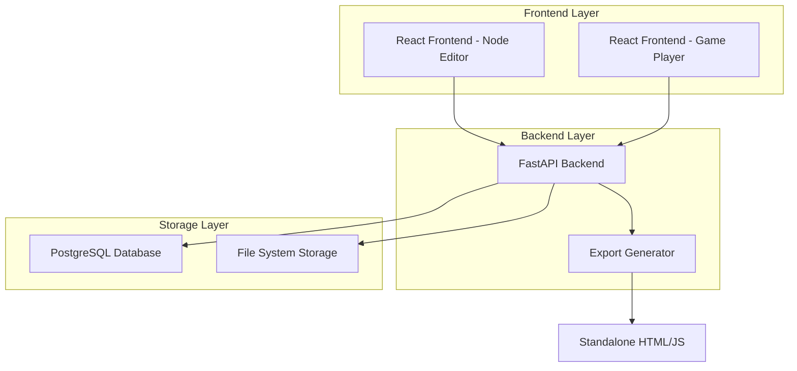

# adventure-game - Task 15

Execute task 15 for the adventure-game specification.

## Task Description
Create node API routes in api/routes/nodes.py

## Code Reuse
**Leverage existing code**: services/project

## Requirements Reference
**Requirements**: 1.1, 5.1

## Usage
```
/Task:15-adventure-game
```

## Instructions

Execute with @spec-task-executor agent the following task: "Create node API routes in api/routes/nodes.py"

```
Use the @spec-task-executor agent to implement task 15: "Create node API routes in api/routes/nodes.py" for the adventure-game specification and include all the below context.

# Steering Context
## Steering Documents Context

No steering documents found or all are empty.

# Specification Context
## Specification Context (Pre-loaded): adventure-game

### Requirements
# Requirements Document

## Introduction

The adventure game framework is a web-based application that enables users to create, design, and deploy interactive text-based adventure games. The system provides a visual node editor for game designers to create branching narratives with conditional logic, and generates playable web versions of the games. The framework consists of two main components: a game designer interface for creating games through drag-and-drop functionality, and a game player interface for experiencing the created adventures.

## Alignment with Product Vision

This feature supports creating engaging interactive content platforms that allow both creators and consumers to participate in narrative experiences. It promotes user-generated content and provides tools for creative expression in the gaming domain.

## Requirements

### Requirement 1: Visual Node Editor

**User Story:** As a game designer, I want to create game nodes with multiple choice options through a visual drag-and-drop interface, so that I can design branching storylines without writing code.

#### Acceptance Criteria

1. WHEN a designer opens the editor THEN the system SHALL display a blank canvas with the ability to add nodes
2. WHEN a designer creates a new node THEN the system SHALL allow them to add a text description and multiple choice options
3. WHEN a designer drags from one node's option to another node THEN the system SHALL create a visual connection between them
4. WHEN a designer connects options to nodes THEN the system SHALL store the relationship for game flow logic
5. WHEN a designer saves the project THEN the system SHALL persist all nodes, options, and connections

### Requirement 2: Conditional Logic System

**User Story:** As a game designer, I want to set conditions on choice options that must be met for players to select them, so that I can create complex branching narratives with prerequisites.

#### Acceptance Criteria

1. WHEN a designer selects an option THEN the system SHALL provide an interface to add conditions
2. IF a condition is set on an option THEN the system SHALL only display that option to players when conditions are met
3. WHEN a player encounters a node THEN the system SHALL evaluate all option conditions and show only available choices
4. WHEN conditions involve game state THEN the system SHALL track and update state variables throughout gameplay

### Requirement 3: Game State Management

**User Story:** As a game player, I want my choices and progress to be tracked throughout the game, so that conditions and story elements can respond to my previous decisions.

#### Acceptance Criteria

1. WHEN a player makes a choice THEN the system SHALL update relevant state variables
2. WHEN a player reaches a new node THEN the system SHALL evaluate the current game state against any conditions
3. IF a player reloads the game THEN the system SHALL maintain their current progress and state
4. WHEN state variables change THEN the system SHALL make them available for condition evaluation

### Requirement 4: Game Export and Deployment

**User Story:** As a game designer, I want to export my completed game as a standalone web application, so that players can access and play the game independently.

#### Acceptance Criteria

1. WHEN a designer completes their game THEN the system SHALL provide an export function
2. WHEN a game is exported THEN the system SHALL generate a self-contained web application
3. WHEN a player accesses the exported game THEN the system SHALL provide a clean playing interface without editing tools
4. IF the exported game is deployed THEN the system SHALL ensure all game logic functions correctly

### Requirement 5: Node Content Management

**User Story:** As a game designer, I want to add rich text content to game nodes including descriptions and choice text, so that I can create engaging narrative experiences.

#### Acceptance Criteria

1. WHEN a designer edits a node THEN the system SHALL provide a text editor for the main content
2. WHEN a designer adds choice options THEN the system SHALL allow custom text for each choice
3. WHEN a player views a node THEN the system SHALL display the content in a readable format
4. IF text content is lengthy THEN the system SHALL provide appropriate formatting and display options

### Requirement 6: Project Management

**User Story:** As a game designer, I want to save, load, and manage multiple game projects, so that I can work on different adventures and maintain my work over time.

#### Acceptance Criteria

1. WHEN a designer creates a new project THEN the system SHALL initialize a blank game structure
2. WHEN a designer saves a project THEN the system SHALL store all game data with a project name
3. WHEN a designer loads a project THEN the system SHALL restore all nodes, connections, and settings
4. WHEN a designer lists projects THEN the system SHALL display all saved games with metadata

## Non-Functional Requirements

### Performance
- The visual editor SHALL respond to user interactions within 100ms
- Game export SHALL complete within 30 seconds for games with up to 1000 nodes
- The player interface SHALL load exported games within 5 seconds

### Security
- All user-generated content SHALL be sanitized to prevent XSS attacks
- Exported games SHALL not contain executable code beyond the game logic
- Project data SHALL be stored securely and accessed only by the creator

### Reliability
- The system SHALL auto-save project changes every 5 minutes
- Game state SHALL persist reliably across browser sessions
- The visual editor SHALL handle up to 1000 nodes without performance degradation

### Usability
- The drag-and-drop interface SHALL provide visual feedback for all interactions
- Error messages SHALL be clear and actionable when game logic issues are detected
- The exported game interface SHALL be intuitive for players without instruction

---

### Design
# Design Document

## Overview

The adventure game framework is a full-stack web application built with Python FastAPI backend and React frontend. The system consists of three main components: a visual node editor for game creation, a game player interface, and an export system that generates standalone web applications. The architecture follows a modern API-first approach with clear separation between the game engine, editor interface, and player interface.

## Steering Document Alignment

### Technical Standards (tech.md)
The design follows modern Python web development best practices using FastAPI for high-performance async APIs, React for responsive user interfaces, and PostgreSQL for reliable data persistence. The architecture supports horizontal scaling and follows REST API conventions.

### Project Structure (structure.md)
The implementation will follow Python package conventions with separate modules for models, services, API routes, and utilities. Frontend components will be organized by feature with shared utilities and reusable components.

## Code Reuse Analysis

Since this is a new project with a fresh codebase, the focus will be on establishing reusable patterns and components that can be extended for future features.

### Components to Create for Reuse
- **Database Models**: Base classes for entities with common fields (id, created_at, updated_at)
- **API Utilities**: Standard response formatting, error handling, and authentication decorators
- **Frontend Components**: Drag-and-drop utilities, modal dialogs, form components

### Integration Points
- **Authentication System**: JWT-based authentication for project ownership
- **File Storage**: Local filesystem with option to extend to cloud storage
- **State Management**: Zustand stores for game state, project state, and UI state

## Architecture

The system uses a three-tier architecture with clear separation of concerns:



## Components and Interfaces

### Backend Components

#### Game Engine Service
- **Purpose:** Core game logic for state management, condition evaluation, and flow control
- **Interfaces:** 
  - `evaluate_conditions(state: GameState, conditions: List[Condition]) -> bool`
  - `update_state(state: GameState, choice: Choice) -> GameState`
  - `get_available_choices(node: GameNode, state: GameState) -> List[Choice]`
- **Dependencies:** Database models, condition evaluator
- **Reuses:** Base service patterns, validation utilities

#### Project Management Service
- **Purpose:** Handles CRUD operations for game projects, nodes, and choices
- **Interfaces:**
  - `create_project(user_id: str, project_data: ProjectCreate) -> Project`
  - `save_project(project_id: str, nodes: List[Node], connections: List[Connection]) -> bool`
  - `load_project(project_id: str) -> ProjectData`
- **Dependencies:** Database models, file storage
- **Reuses:** Base CRUD patterns, authentication decorators

#### Export Service
- **Purpose:** Generates standalone HTML/JS applications from game projects
- **Interfaces:**
  - `export_game(project_id: str) -> str` (returns file path)
  - `generate_player_html(game_data: GameData) -> str`
  - `bundle_assets() -> Dict[str, str]`
- **Dependencies:** Template engine, game data models
- **Reuses:** File utilities, template patterns

### Frontend Components

#### Node Editor Component
- **Purpose:** Visual drag-and-drop interface for creating game nodes and connections
- **Interfaces:**
  - `onNodeCreate(position: Position) -> void`
  - `onConnectionCreate(source: NodeId, target: NodeId) -> void`
  - `onNodeUpdate(nodeId: NodeId, data: NodeData) -> void`
- **Dependencies:** React Flow, Zustand store
- **Reuses:** Base component patterns, drag-and-drop utilities

#### Game Player Component
- **Purpose:** Renders game content and handles player interactions
- **Interfaces:**
  - `loadGame(gameData: GameData) -> void`
  - `makeChoice(choiceId: string) -> void`
  - `saveGameState() -> void`
- **Dependencies:** Game state store, API client
- **Reuses:** State management patterns, UI components

#### Project Browser Component
- **Purpose:** Lists and manages user's game projects
- **Interfaces:**
  - `loadProjects() -> void`
  - `createProject(name: string) -> void`
  - `deleteProject(projectId: string) -> void`
- **Dependencies:** API client, project store
- **Reuses:** List components, modal dialogs

## Data Models

### Project Model
```python
class Project(BaseModel):
    id: str  # UUID
    name: str
    description: Optional[str]
    user_id: str
    created_at: datetime
    updated_at: datetime
    published: bool = False
```

### GameNode Model
```python
class GameNode(BaseModel):
    id: str  # UUID
    project_id: str
    title: str
    content: str  # Main narrative text
    position_x: float  # For visual editor
    position_y: float
    is_start_node: bool = False
    is_end_node: bool = False
```

### Choice Model
```python
class Choice(BaseModel):
    id: str  # UUID
    node_id: str  # Source node
    text: str  # Choice text displayed to player
    target_node_id: Optional[str]  # Target node (null for end choices)
    conditions: List[Condition] = []  # Conditions to show this choice
    state_changes: Dict[str, Any] = {}  # State updates when chosen
```

### Condition Model
```python
class Condition(BaseModel):
    id: str
    variable: str  # State variable name
    operator: str  # eq, gt, lt, contains, etc.
    value: Any  # Value to compare against
    logic_operator: str = "AND"  # AND/OR for multiple conditions
```

### GameState Model
```python
class GameState(BaseModel):
    current_node_id: str
    variables: Dict[str, Any] = {}  # Player's game state variables
    visited_nodes: List[str] = []
    choice_history: List[str] = []
    created_at: datetime
```

## Error Handling

### Error Scenarios

1. **Invalid Game Structure**
   - **Handling:** Validate node connections, detect unreachable nodes, require start node
   - **User Impact:** Show validation errors with specific node references, prevent export until resolved

2. **Condition Evaluation Failures**
   - **Handling:** Log errors, provide default fallback behavior, sanitize user expressions
   - **User Impact:** Display friendly error messages, suggest condition syntax corrections

3. **Network/Database Failures**
   - **Handling:** Implement retry logic, graceful degradation, local caching where possible
   - **User Impact:** Show connection status, enable offline mode for game playing

4. **Export Generation Errors**
   - **Handling:** Validate game data before export, provide detailed error logs
   - **User Impact:** Clear error messages with actionable steps to fix game structure

5. **File Storage Issues**
   - **Handling:** Implement backup strategies, validate file permissions, handle disk space
   - **User Impact:** Inform users of storage issues, provide alternative save options

## Testing Strategy

### Unit Testing
- Test game engine logic with various state combinations and conditions
- Test data model validation and serialization
- Test API endpoints with mock data and edge cases
- Test React components with React Testing Library

### Integration Testing
- Test complete game flow from node creation to playing
- Test project save/load cycles with database persistence
- Test export generation with various game structures
- Test authentication and authorization flows

### End-to-End Testing
- Test complete user journeys: create project → build game → export → play
- Test drag-and-drop interactions in the visual editor
- Test game playing experience with complex branching scenarios
- Test project sharing and collaboration features

**Note**: Specification documents have been pre-loaded. Do not use get-content to fetch them again.

## Task Details
- Task ID: 15
- Description: Create node API routes in api/routes/nodes.py
- Leverage: services/project
- Requirements: 1.1, 5.1

## Instructions
- Implement ONLY task 15: "Create node API routes in api/routes/nodes.py"
- Follow all project conventions and leverage existing code
- Mark the task as complete using: claude-code-spec-workflow get-tasks adventure-game 15 --mode complete
- Provide a completion summary
```

## Task Completion
When the task is complete, mark it as done:
```bash
claude-code-spec-workflow get-tasks adventure-game 15 --mode complete
```

## Next Steps
After task completion, you can:
- Execute the next task using /adventure-game-task-[next-id]
- Check overall progress with /spec-status adventure-game
