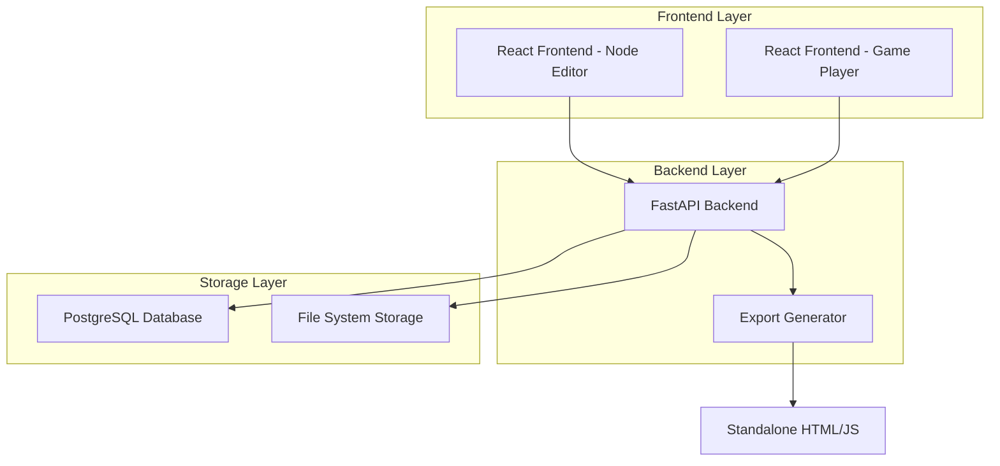

# Design Document

## Overview

The adventure game framework is a full-stack web application built with Python FastAPI backend and React frontend. The system consists of three main components: a visual node editor for game creation, a game player interface, and an export system that generates standalone web applications. The architecture follows a modern API-first approach with clear separation between the game engine, editor interface, and player interface.

## Steering Document Alignment

### Technical Standards (tech.md)
The design follows modern Python web development best practices using FastAPI for high-performance async APIs, React for responsive user interfaces, and PostgreSQL for reliable data persistence. The architecture supports horizontal scaling and follows REST API conventions.

### Project Structure (structure.md)
The implementation will follow Python package conventions with separate modules for models, services, API routes, and utilities. Frontend components will be organized by feature with shared utilities and reusable components.

## Code Reuse Analysis

Since this is a new project with a fresh codebase, the focus will be on establishing reusable patterns and components that can be extended for future features.

### Components to Create for Reuse
- **Database Models**: Base classes for entities with common fields (id, created_at, updated_at)
- **API Utilities**: Standard response formatting, error handling, and authentication decorators
- **Frontend Components**: Drag-and-drop utilities, modal dialogs, form components

### Integration Points
- **Authentication System**: JWT-based authentication for project ownership
- **File Storage**: Local filesystem with option to extend to cloud storage
- **State Management**: Zustand stores for game state, project state, and UI state

## Architecture

The system uses a three-tier architecture with clear separation of concerns:



## Components and Interfaces

### Backend Components

#### Game Engine Service
- **Purpose:** Core game logic for state management, condition evaluation, and flow control
- **Interfaces:** 
  - `evaluate_conditions(state: GameState, conditions: List[Condition]) -> bool`
  - `update_state(state: GameState, choice: Choice) -> GameState`
  - `get_available_choices(node: GameNode, state: GameState) -> List[Choice]`
- **Dependencies:** Database models, condition evaluator
- **Reuses:** Base service patterns, validation utilities

#### Project Management Service
- **Purpose:** Handles CRUD operations for game projects, nodes, and choices
- **Interfaces:**
  - `create_project(user_id: str, project_data: ProjectCreate) -> Project`
  - `save_project(project_id: str, nodes: List[Node], connections: List[Connection]) -> bool`
  - `load_project(project_id: str) -> ProjectData`
- **Dependencies:** Database models, file storage
- **Reuses:** Base CRUD patterns, authentication decorators

#### Export Service
- **Purpose:** Generates standalone HTML/JS applications from game projects
- **Interfaces:**
  - `export_game(project_id: str) -> str` (returns file path)
  - `generate_player_html(game_data: GameData) -> str`
  - `bundle_assets() -> Dict[str, str]`
- **Dependencies:** Template engine, game data models
- **Reuses:** File utilities, template patterns

### Frontend Components

#### Node Editor Component
- **Purpose:** Visual drag-and-drop interface for creating game nodes and connections
- **Interfaces:**
  - `onNodeCreate(position: Position) -> void`
  - `onConnectionCreate(source: NodeId, target: NodeId) -> void`
  - `onNodeUpdate(nodeId: NodeId, data: NodeData) -> void`
- **Dependencies:** React Flow, Zustand store
- **Reuses:** Base component patterns, drag-and-drop utilities

#### Game Player Component
- **Purpose:** Renders game content and handles player interactions
- **Interfaces:**
  - `loadGame(gameData: GameData) -> void`
  - `makeChoice(choiceId: string) -> void`
  - `saveGameState() -> void`
- **Dependencies:** Game state store, API client
- **Reuses:** State management patterns, UI components

#### Project Browser Component
- **Purpose:** Lists and manages user's game projects
- **Interfaces:**
  - `loadProjects() -> void`
  - `createProject(name: string) -> void`
  - `deleteProject(projectId: string) -> void`
- **Dependencies:** API client, project store
- **Reuses:** List components, modal dialogs

## Data Models

### Project Model
```python
class Project(BaseModel):
    id: str  # UUID
    name: str
    description: Optional[str]
    user_id: str
    created_at: datetime
    updated_at: datetime
    published: bool = False
```

### GameNode Model
```python
class GameNode(BaseModel):
    id: str  # UUID
    project_id: str
    title: str
    content: str  # Main narrative text
    position_x: float  # For visual editor
    position_y: float
    is_start_node: bool = False
    is_end_node: bool = False
```

### Choice Model
```python
class Choice(BaseModel):
    id: str  # UUID
    node_id: str  # Source node
    text: str  # Choice text displayed to player
    target_node_id: Optional[str]  # Target node (null for end choices)
    conditions: List[Condition] = []  # Conditions to show this choice
    state_changes: Dict[str, Any] = {}  # State updates when chosen
```

### Condition Model
```python
class Condition(BaseModel):
    id: str
    variable: str  # State variable name
    operator: str  # eq, gt, lt, contains, etc.
    value: Any  # Value to compare against
    logic_operator: str = "AND"  # AND/OR for multiple conditions
```

### GameState Model
```python
class GameState(BaseModel):
    current_node_id: str
    variables: Dict[str, Any] = {}  # Player's game state variables
    visited_nodes: List[str] = []
    choice_history: List[str] = []
    created_at: datetime
```

## Error Handling

### Error Scenarios

1. **Invalid Game Structure**
   - **Handling:** Validate node connections, detect unreachable nodes, require start node
   - **User Impact:** Show validation errors with specific node references, prevent export until resolved

2. **Condition Evaluation Failures**
   - **Handling:** Log errors, provide default fallback behavior, sanitize user expressions
   - **User Impact:** Display friendly error messages, suggest condition syntax corrections

3. **Network/Database Failures**
   - **Handling:** Implement retry logic, graceful degradation, local caching where possible
   - **User Impact:** Show connection status, enable offline mode for game playing

4. **Export Generation Errors**
   - **Handling:** Validate game data before export, provide detailed error logs
   - **User Impact:** Clear error messages with actionable steps to fix game structure

5. **File Storage Issues**
   - **Handling:** Implement backup strategies, validate file permissions, handle disk space
   - **User Impact:** Inform users of storage issues, provide alternative save options

## Testing Strategy

### Unit Testing
- Test game engine logic with various state combinations and conditions
- Test data model validation and serialization
- Test API endpoints with mock data and edge cases
- Test React components with React Testing Library

### Integration Testing
- Test complete game flow from node creation to playing
- Test project save/load cycles with database persistence
- Test export generation with various game structures
- Test authentication and authorization flows

### End-to-End Testing
- Test complete user journeys: create project → build game → export → play
- Test drag-and-drop interactions in the visual editor
- Test game playing experience with complex branching scenarios
- Test project sharing and collaboration features